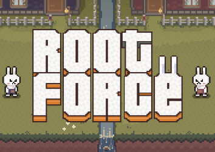

# Root Force

## Overview
Root Force is a 2-player game where players take turns unearthing, charging and throwing carrots at each other. The goal is to hit the opponent and deplete all the carrots from your own field.

https://user-images.githubusercontent.com/9122142/216828419-125a6cb7-12e4-4a99-9054-ac18c067bee8.mov

---

## Downloads
* [PLAY ONLINE](https://marcelschmidt1337.github.io/ggj2023/)
* [DOWNLOAD (MACOS)](https://marcelschmidt1337.github.io/ggj2023/downloads/RootForce_Mac.zip)
* [DOWNLOAD (WINDOWS)](https://marcelschmidt1337.github.io/ggj2023/downloads/RootForce_Windows.zip)

## Gameplay
1. Both players start with an equally populated field of carrots.
2. Players move around the field unearthing their carrots by holding down the charge button.
3. Once the player has unearthed the carrot, they can use the action button to charge the throw.
3. Once a player has fully charged, they can release the charge button to throw the carrot at their opponent.
4. If a player successfully hits their opponent, they will stun them for a brief period of time.
5. The game continues until one player's field is empty of ROOTs or the timer runs out.

## Controls
- Move character: WASD/ arrow keys
- Action button : hold spacebar / Hold right shift

## Features
- Fast-paced, local 2 player action
- Simple, intuitive controls
- Pseudoprocedural generated terrain
- Amazing pixel-art style
- Unique soul-crushing sounds

## Requirements
- Keyboard, Controller
- Mac, Windows, Browser
- Graphics card with at least 128 MB of VRAM

## Watch the Trailer
Check out the official trailer for Root Force to get a feel for the fast-paced, carrot-throwing action. Watch as two players face off, charging and launching their carrots in an attempt to deplete their own field from the ROOT pest. With simple, intuitive controls and endless replayability, Root Force is the perfect game for players of all skill levels.

## Disclaimer
The code is a beauty to admire through the lense of abstract art.
